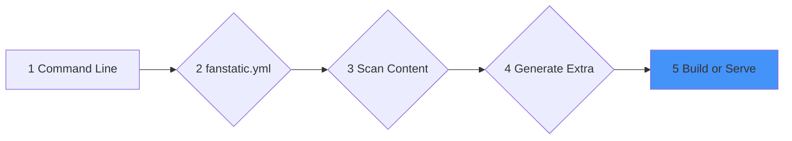

This documentation describes the common flow shared by the Fanstatic [build](build-command) and [serve](live-server-command) commands. These commands transform your source files into a fully generated website and provide a local development environment.



Steps 1 to 4 are common to both commands.

## Step 1: Command Line Arguments

The build and serve commands accept arguments that customize the generation process:

* `--source` or `-s`: Specifies the source directory (default: `./`).
* `--verbose` or `-v`: Enables detailed logging.
* `--help` or `-h`: Show usage information.
* `--version`: Show version information.

#### Basic commands

```bash
# Build for production
fanstatic build

# Start dev server
fanstatic serve
```

## Step 2: Configuration (fanstatic.yml)

Fanstatic reads the `fanstatic.yaml` (or `fanstatic.yml`) file in the source folder. This file defines site-wide variables like title, base URL, and the active theme.

## Step 3: Content Parsing

Fanstatic scans the `content/` directory for Markdown files. Each file is parsed to extract YAML front matter and its main content.

## Step 4: Metadata Generation

Fanstatic generates additional metadata, such as tags and taxonomies, based on the front matter of all parsed files. It also handles the generation of virtual pages (like paginated lists).

## Step 5: Rendering and Output

**Build**: Fanstatic applies Liquid templates to the content and writes the resulting HTML files to the output folder (default: `public/`).

**Serve**: Fanstatic keeps the site metadata in memory and renders pages on-demand. It watches the file system for changes and triggers a rebuild and browser reload automatically when files are modified.
