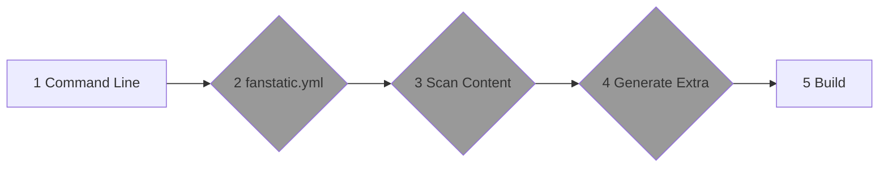

This command unleashes the magic of **Fanstatic**, transforming your source files into a fully generated website.

Let's explore the technical steps involved in the build process flow.



## Step 1: Command Line Arguments

Our adventure begins with the command line arguments you provide to guide the **Fanstatic** build process. These arguments act as your magical incantations, allowing you to customize and shape the website generation according to your desires.

### Option Details

Let's explore the details of each available command line argument for the **Fanstatic** build command:

* `--output` or `-o`: Specifies the output directory path. Use this option to set a custom directory where the generated website files will be saved. If not specified, the default output directory is ./public.

These options provide flexibility and customization to tailor the build command according to your specific requirements. You can combine them as needed to achieve the desired results when generating your **Fanstatic** website.

### Command Line Usage Examples

Here are five examples showcasing the usage of the **Fanstatic** build command, demonstrating the combination of different arguments:

#### Specify source directory and output directory

```bash
fanstatic build --source ./my-site --output ./dist
```

In this example, the build command is executed using a custom source directory (./my-site). The generated files will be output to the ./dist directory.

#### Combine source, output, and verbose options using the short form

```bash
fanstatic build -s ./my-site -o ./dist -v
```

This is a shorter version of the previous example, utilizing the abbreviated forms of the options. The result is the same, with the source directory set to ./my-site, the output directory set to ./dist, and verbose output enabled.

## Step 2 to 4

It's the same for Build Command, so it's described in the [Flow](../) page.

## Step 5: Write Pages to Output Folder

Now, dear adventurers, comes the moment of truth. **Fanstatic** wields its mighty quill, painstakingly inscribing each piece of front matter, including the magnificent homepage, into the enchanted output folder. With every stroke, **Fanstatic** generates the necessary HTML files, meticulously organizes the content structure, applies the chosen theme, and imbues the files with the essence of the gathered data. Behold, within the output folder lies your complete website—a masterpiece ready to be hosted and shared with the world.

***

With these extraordinary steps, **Fanstatic** completes the build process, transforming your source files into a breathtakingly beautiful and fully functional website.

So, dear developers, unlock the true power of fanstatic build and witness the enchantment of **Fanstatic** as it weaves its magic, bringing your website to life with unrivaled efficiency and elegance. Embark on this extraordinary journey, and may your creations shine brightly in the digital realm. Happy building!
