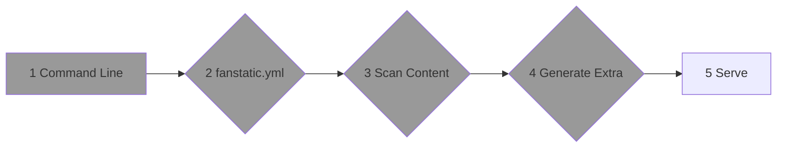

This command unleashes the magic of **Fanstatic**, allowing you to serve your website locally for a seamless development experience. Let's dive into the details, following the same structure as before.

## Step 1 to 4

It's the same for Build Command, so it's described in the [Flow](../) page.

## Step 5: Keep Metadata in Memory - Dynamic Page Generation

Now comes the significant difference with the build command. Instead of generating all the pages upfront, **Fanstatic** keeps the metadata in memory. This means that the actual page generation occurs dynamically when a page is requested. **Fanstatic** constantly monitors the source folder for any changes, rescanning all files and rebuilding the metadata as needed. To enhance the development experience, a JavaScript snippet is injected into the served pages, automatically reloading them when the server restarts.

With these steps, **Fanstatic** completes the serve command, allowing you to preview your website locally while enjoying the convenience of dynamic page generation and real-time updates.

Dear adventurers, harness the power of fanstatic serve and experience the enchantment of **Fanstatic** as it serves your website with unrivaled grace and flexibility. Let your creativity soar as you witness the magic unfold before your eyes. Happy serving!
